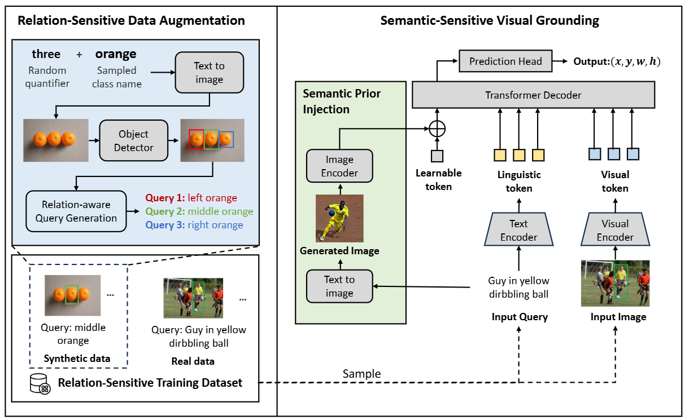

# ResVG

This repository is the official Pytorch implementation for paper **ResVG: Enhancing Relation and Semantic Understanding in Multiple Instances for Visual Grounding**.

In this paper, we propose a novel approach, the **Re**lation and **S**emantic-sensitive **V**isual **G**rounding (ReSVG) model, to improve the model's understanding of relation and semantic in multiple instances. Firstly, we enhance the model's understanding of fine-grained semantics by injecting semantic prior information derived from text queries into the model. This is achieved by leveraging text-to-image generation models to produce images representing the semantic attributes of target objects described in queries. Secondly, we tackle the lack of training samples with multiple distractions by introducing a relation-sensitive data augmentation method. This method generates additional training data by synthesizing images containing multiple objects of the same category and pseudo queries based on their spatial relationships. The proposed ReSVG model significantly improves the model's ability to comprehend both object semantics and spatial relations, leading to enhanced performance in visual grounding tasks, particularly in scenarios with multiple-instance distractions.

Our paper was accepted by ACM-MM 2024. 

[[Paper](https://arxiv.org/pdf/2408.16314)] [[Project Page](https://minghangz.github.io/publication/resvg/)] [[Video](https://www.youtube.com/watch?v=Mtxkklph16o)]



## Contents

1. [Usage](#usage)
2. [Results](#results)
3. [Contacts](#contacts)
4. [Acknowledgments](#acknowledgments)

## Usage

### Dependencies
- Python 3.9.10
- PyTorch 1.9.0 + cu111 + cp39
- Check [requirements.txt](requirements.txt) for other dependencies. 

### Data Preparation

You can download the images follow [TransVG](https://github.com/djiajunustc/TransVG/blob/main/docs/GETTING_STARTED.md) and place them in ./ln_data folder:

The training samples can be download from [data](https://disk.pku.edu.cn/link/AA6D7224C7C18142BE9F5F6EAFC17813F3). Finally, the `./data/` folder will have the following structure:

```
|-- data
      |-- flickr
      |-- gref
      |-- gref_umd
      |-- referit
      |-- unc
      |-- unc+
```

### Pretrained Checkpoints
1.You can download the DETR checkpoints from [detr_checkpoints](https://disk.pku.edu.cn:443/link/4E6B5343270CC07E52A88AA8A7A31CE8). These checkpoints should be downloaded and move to the checkpoints directory.

```
mkdir pretrained_checkpoints
mv detr_checkpoints.tar.gz ./pretrained_checkpoints/
tar -zxvf detr_checkpoints.tar.gz
```

### Training and Evaluation

1.  Training on RefCOCO. 
    ```
    CUDA_VISIBLE_DEVICES=0,1,2,3 python -m torch.distributed.launch --nproc_per_node=4 --use_env train.py --config configs/ResVG_R50_unc.py --test_split val
    ```

2.  Evaluation on RefCOCO.
    ```
    python -m torch.distributed.launch --nproc_per_node=4 --use_env test.py --config configs/ResVG_R50_unc.py --checkpoint ResVG_R50_unc.pth --batch_size_test 32 --test_split testA;
    ```

## Results

<table border="2">
    <thead>
        <tr>
            <th colspan=3> &nbsp&nbsp&nbsp&nbsp&nbsp&nbsp&nbsp RefCOCO </th>
            <th colspan=3> &nbsp&nbsp&nbsp&nbsp&nbsp&nbsp&nbsp RefCOCO+</th>
            <th colspan=3> &nbsp&nbsp&nbsp&nbsp&nbsp&nbsp&nbsp RefCOCOg</th>
            <th colspan=1> ReferItGame</th>
            <th colspan=1> Flickr30K</th>
        </tr>
    </thead>
    <tbody>
    <tr>    
            <td>val</td>
            <td>testA</td>
            <td>testB</td>
            <td>val</td>
            <td>testA</td>
            <td>testB</td>
            <td>g-val</td>
            <td>u-val</td>
            <td>u-test</td>
            <td>test</td>
            <td>test</td>
        </tr>
    </tbody>
    <tbody>
    <tr>
            <td>85.51</td>
            <td>88.76</td>
            <td>79.93</td>
            <td>73.95</td>
            <td>79.53</td>
            <td>64.88</td>
            <td>73.13</td>
            <td>75.77</td>
            <td>74.53</td>
            <td>72.35</td>
            <td>79.52</td>
        </tr>
    </tbody>
</table>
